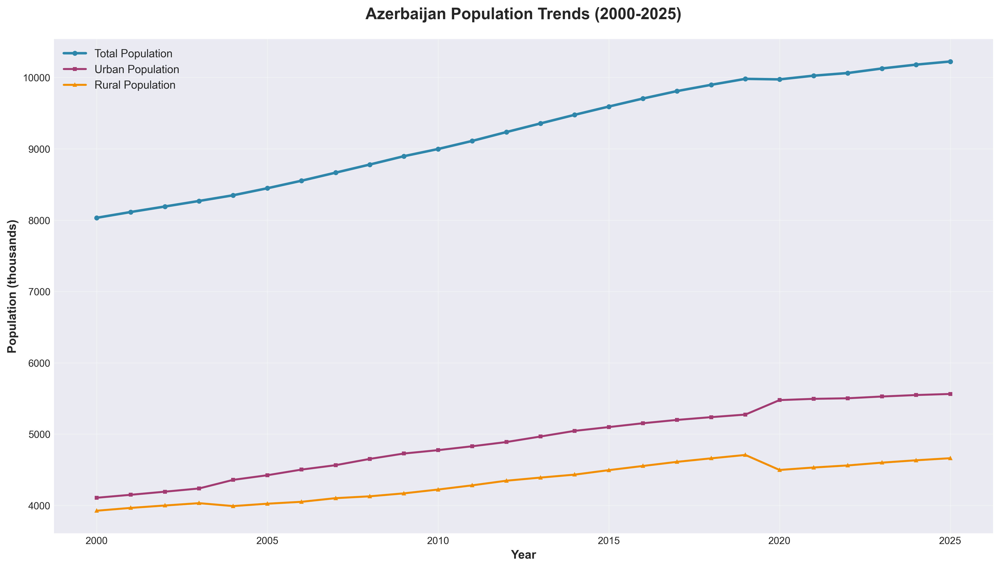
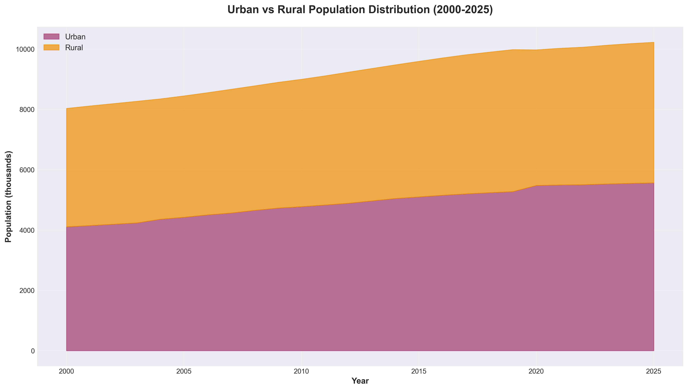
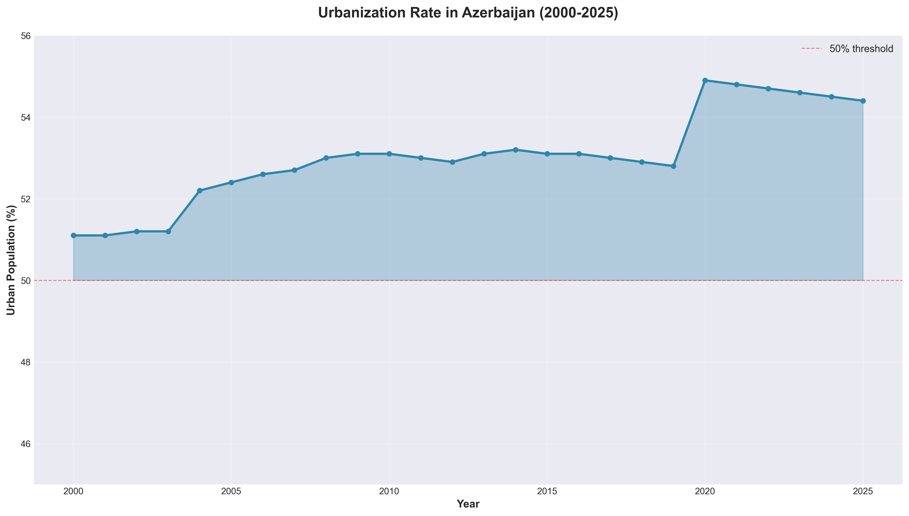
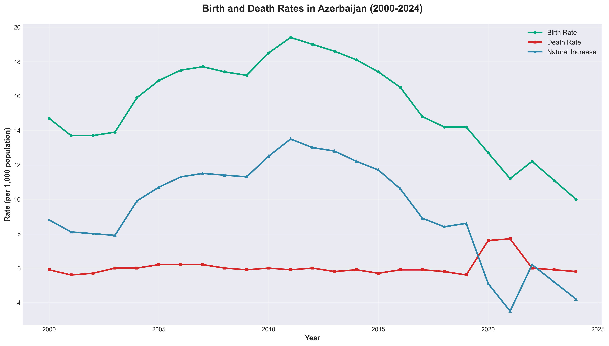
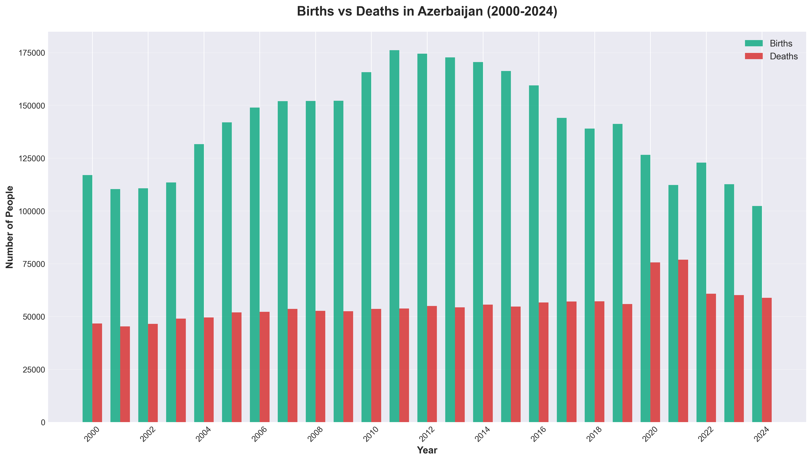
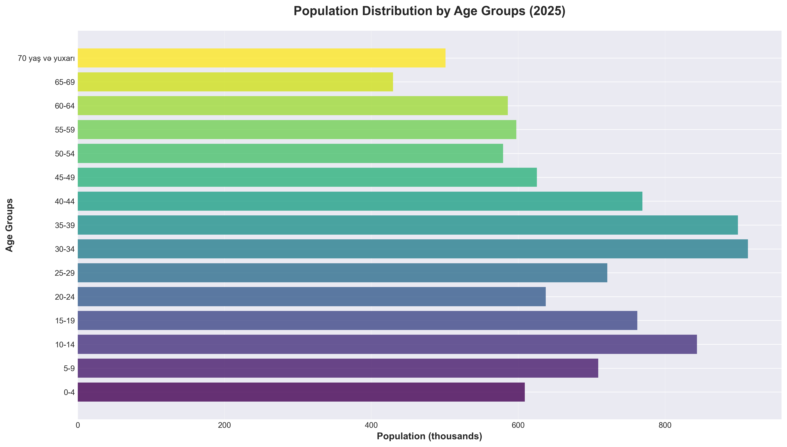
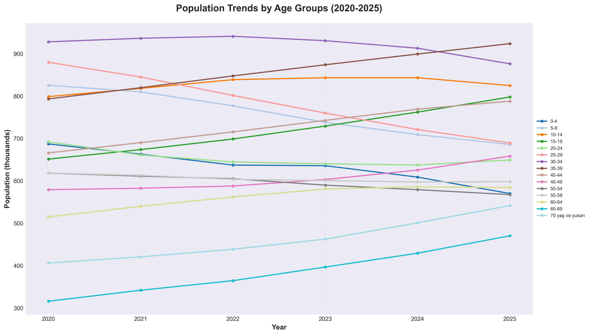
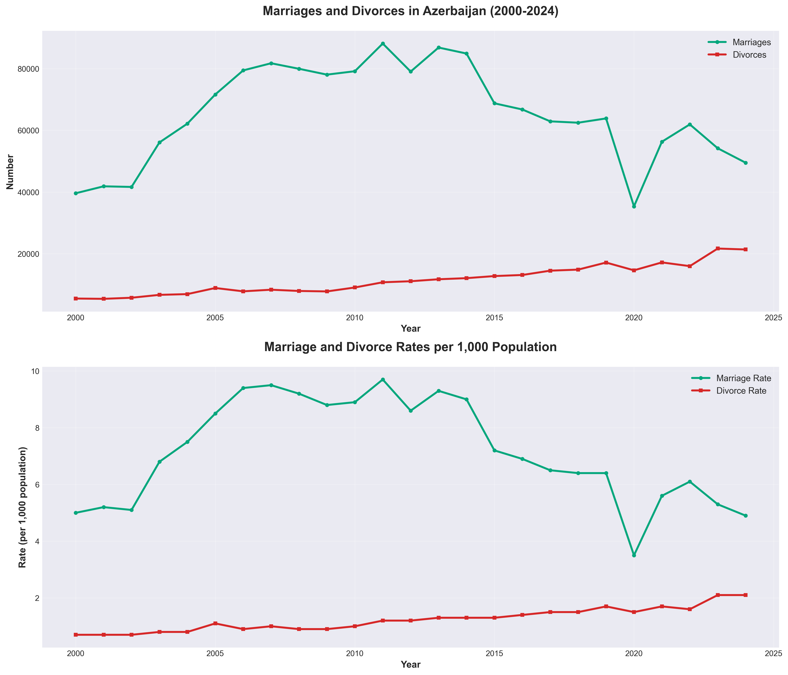
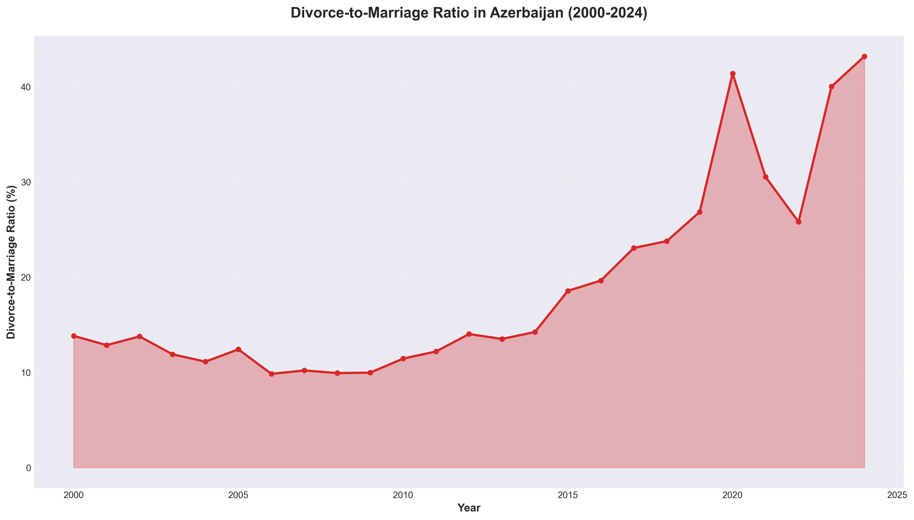

# Azerbaijan Population Analysis (2000-2025)

## Comprehensive Demographic Study and Insights

---

## Executive Summary

This analysis presents a comprehensive overview of Azerbaijan's demographic trends over the past 25 years (2000-2025), examining population growth, urbanization patterns, vital statistics, age distribution, and family dynamics.

### Key Highlights

- **Population Growth**: Azerbaijan's population increased by **27.3%** from 8.03 million (2000) to 10.22 million (2025)
- **Urbanization Milestone**: The country achieved majority urban population status, with **54.4%** living in urban areas by 2025
- **Demographic Transition**: Birth rates declined from 14.7 to 10.0 per 1,000 population (2000-2024)
- **Family Structure Changes**: Divorce-to-marriage ratio increased significantly to **43.2%** in 2024
- **Population Aging**: Notable shifts in age distribution with declining youth populations and growing elderly cohorts

---

## 1. Population Trends and Growth

### Overview
Azerbaijan experienced steady population growth over the 25-year period, adding approximately 2.2 million people to its population base.



### Key Findings

- **Total Population**: Grew from 8,032,800 (2000) to 10,224,900 (2025)
- **Average Annual Growth**: Approximately 1.0% per year
- **Urban Population**: Increased from 4.1M to 5.6M (+35.4%)
- **Rural Population**: Increased from 3.9M to 4.7M (+18.8%)

### Insights

The data reveals a consistent upward trajectory in population growth, with urban areas experiencing significantly faster growth than rural areas. This pattern indicates ongoing internal migration and urban development.

---

## 2. Urban-Rural Dynamics

### Urbanization Transformation





### Key Findings

- **2000**: Urban population was 51.1%, slightly above rural (48.9%)
- **2004**: Major shift occurred with urban population jumping to 52.2%
- **2020**: Significant urbanization jump to 54.9% (possibly related to territorial changes)
- **2025**: Urban population reached 54.4%, rural at 45.6%

### Insights

Azerbaijan crossed the critical 50% urbanization threshold early in the 2000s and has maintained a steady urban majority. The sharp increase in 2020 (from 52.8% to 54.9%) may reflect:
- Post-conflict territorial changes
- Administrative reclassification
- Accelerated urban migration
- Economic opportunities in cities

---

## 3. Birth and Death Rates: Demographic Transition

### Vital Statistics Trends





### Key Findings

**Birth Rate Trends (per 1,000 population):**
- **2000**: 14.7
- **2010**: 18.5 (peak)
- **2024**: 10.0 (significant decline)

**Death Rate Trends (per 1,000 population):**
- **2000-2019**: Relatively stable (5.6-6.0)
- **2020-2021**: Spike to 7.6-7.7 (COVID-19 impact)
- **2024**: Returned to 5.8

**Natural Increase:**
- **2010**: Peak at 12.5 per 1,000
- **2021**: Lowest at 3.5 per 1,000 (pandemic impact)
- **2024**: 4.2 per 1,000

### Critical Insights

1. **Demographic Transition**: Azerbaijan is experiencing a classic demographic transition with declining birth rates, indicating:
   - Economic development
   - Increased urbanization
   - Higher education levels
   - Delayed family formation
   - Access to family planning

2. **COVID-19 Impact**: Clear spike in death rates (2020-2021) with simultaneous birth rate decline:
   - Death rate increased by 35% in 2020
   - Birth rate dropped from 14.2 to 11.2
   - Natural increase fell to historic low

3. **Future Challenges**: Current birth rate of 10.0 per 1,000 approaches replacement-level concerns

---

## 4. Age Distribution and Population Structure

### Current Age Composition (2025)



### Age Group Trends (2020-2025)



### Key Findings

**Declining Youth Populations:**
- Ages 0-4: Decreased from 687K (2020) to 570K (2025) - **17% decline**
- Ages 5-9: Decreased from 826K (2020) to 686K (2025) - **17% decline**
- Ages 25-29: Decreased from 880K (2020) to 689K (2025) - **22% decline**

**Growing Age Groups:**
- Ages 35-39: Increased from 793K (2020) to 924K (2025) - **16% growth**
- Ages 65-69: Increased from 316K (2020) to 470K (2025) - **49% growth**
- Ages 70+: Increased from 406K (2020) to 542K (2025) - **33% growth**

**Largest Age Groups in 2025:**
1. Ages 35-39: 923,600 (9.0% of population)
2. Ages 30-34: 876,100 (8.6% of population)
3. Ages 15-19: 797,700 (7.8% of population)

### Critical Insights

1. **Population Aging**: Clear trend toward an older population structure
   - Elderly (65+) grew by 41% in just 5 years
   - Children (0-14) declining as share of population

2. **Fertility Decline**: Sharp decrease in youngest age groups reflects ongoing birth rate decline

3. **Demographic Dividend Window Closing**: The working-age population (15-64) is at its peak, but the window for maximum economic benefit is narrowing

4. **Future Dependency Ratio**: Growing elderly population with fewer young people suggests:
   - Increased pressure on pension systems
   - Healthcare system demands
   - Need for elder care infrastructure

---

## 5. Marriage and Divorce Patterns

### Family Formation Trends





### Key Findings

**Marriage Trends:**
- **2006**: Peak at 79,443 marriages (9.4 per 1,000)
- **2020**: Sharp drop to 35,348 (COVID-19 impact)
- **2024**: 49,508 marriages (4.9 per 1,000) - **historically low**

**Divorce Trends:**
- **2000**: 5,478 divorces (13.8% of marriages)
- **2023**: Peak at 21,688 divorces
- **2024**: 21,384 divorces (43.2% of marriages)

**Divorce-to-Marriage Ratio:**
- **2000**: 13.8%
- **2010**: 11.4%
- **2024**: 43.2% - **more than tripled**

### Critical Insights

1. **Marriage Decline**: Dramatic decrease in marriage rates:
   - Delayed marriage age
   - Economic factors
   - Changing social attitudes
   - Urbanization effects

2. **Divorce Increase**: Steady rise in both absolute numbers and rates:
   - Social liberalization
   - Women's economic independence
   - Reduced social stigma
   - Legal system accessibility

3. **Family Structure Transformation**: By 2024, nearly half of all marriages end in divorce:
   - Significant shift from traditional family structures
   - Potential impact on child-rearing patterns
   - Economic implications for single-parent households

4. **2020 Anomaly**: COVID-19 pandemic caused:
   - 48% drop in marriages (from 63,869 to 35,348)
   - Divorces remained high (14,628)
   - Ratio spiked as fewer couples married but divorces continued

---

## 6. Major Trends and Patterns

### 1. Rapid Urbanization
- Azerbaijan transitioned from a balanced urban-rural society to an urban-majority nation
- Urban population growth rate significantly exceeds rural growth
- 2020 shows acceleration in urbanization trend

### 2. Demographic Transition in Progress
- Classic pattern: declining birth rates, stable-to-declining death rates
- Natural increase declining from peak of 12.5 (2010) to 4.2 (2024)
- Transition from high-growth to low-growth population dynamics

### 3. Population Aging
- Clear shift in age structure toward older populations
- Youth dependency ratio declining
- Old-age dependency ratio increasing
- Potential economic and social policy challenges ahead

### 4. Family Structure Evolution
- Marriage rates declining significantly
- Divorce rates rising dramatically
- Traditional family models changing rapidly
- May reflect broader social and economic modernization

### 5. COVID-19 Pandemic Impact (2020-2021)
- Mortality spike evident in death rates
- Birth rate acceleration in decline
- Marriage collapse with partial recovery
- Long-term demographic effects still unfolding

---

## 7. Regional Context and Comparisons

### Azerbaijan's Position
Azerbaijan's demographic trends align with patterns observed in other post-Soviet and developing economies:

- **Urbanization**: Similar to regional peers transitioning to urban economies
- **Birth Rate Decline**: Faster than some neighbors, reflecting rapid development
- **Divorce Trends**: Catching up with developed countries' patterns
- **Population Growth**: Still positive, unlike some Eastern European nations

---

## 8. Future Implications and Challenges

### Short-Term (2025-2030)
1. **Continued urbanization** requiring infrastructure investment
2. **Labor force stability** with working-age population at peak
3. **Education system adjustment** to smaller youth cohorts
4. **Healthcare demand** increasing for aging population

### Medium-Term (2030-2040)
1. **Potential population stagnation** if birth rates remain low
2. **Pension system pressure** from growing elderly population
3. **Housing demand shifts** toward smaller urban units
4. **Migration patterns** may become critical for growth

### Long-Term (2040+)
1. **Population decline risk** if fertility remains below replacement
2. **Aging society challenges** similar to developed nations
3. **Economic model adaptation** needed for demographic reality
4. **Social support systems** requiring comprehensive reform

---

## 9. Policy Considerations

Based on the data analysis, several policy areas merit attention:

### Demographic Sustainability
- **Pro-natalist policies**: Consider incentives for family formation and childbearing
- **Work-life balance**: Support for working parents (childcare, parental leave)
- **Housing affordability**: Especially for young families in urban areas

### Aging Population
- **Pension system reform**: Prepare for increased dependency ratios
- **Healthcare expansion**: Geriatric care, long-term care facilities
- **Active aging programs**: Keep elderly engaged and productive longer

### Urban Development
- **Infrastructure investment**: Meet demands of growing urban population
- **Rural development**: Prevent complete rural depopulation
- **Regional balance**: Ensure development beyond major cities

### Family Support
- **Divorce mediation services**: Address family stability
- **Single-parent support**: Growing need given divorce trends
- **Marriage counseling**: Preventive family services

---

## 10. Methodology and Data Sources

### Data Collection
- **Source**: Official statistics from the President of Azerbaijan's website
- **URL**: https://president.az/az/pages/view/azerbaijan/population
- **Coverage**: 2000-2025 (some series to 2024)
- **Tables Analyzed**: 4 comprehensive demographic tables

### Analysis Tools
- **Python Libraries**: pandas, matplotlib, numpy
- **Visualization**: Custom charts with professional styling
- **Data Processing**: Automated scraping and cleaning

### Reproducibility
All analysis can be reproduced using:
```bash
# Scrape latest data
python3 scrape_population_tables.py

# Generate charts
python3 create_charts.py
```

---

## 11. Conclusions

Azerbaijan's demographic landscape has undergone profound transformation over the past 25 years:

1. **Economic Development Reflected**: Demographic trends mirror successful economic development - urbanization, declining birth rates, and changing family structures

2. **Transition Phase**: The country is in mid-demographic transition, moving from high-growth to low-growth dynamics

3. **Window of Opportunity**: Current favorable age structure provides economic opportunity, but the window is closing

4. **Social Modernization**: Rapid changes in marriage, divorce, and family formation indicate deep social transformation

5. **Future Challenges**: Aging population and declining birth rates will require proactive policy responses

6. **Resilience Demonstrated**: Population maintained growth trajectory despite significant shocks (COVID-19, conflicts)

### Final Assessment

Azerbaijan's demographic data reveals a nation in rapid transformation, successfully managing urbanization and development but facing emerging challenges of low fertility and population aging. The next decade will be critical for implementing policies that ensure demographic sustainability while maintaining economic growth.

---

## Data Visualizations Summary

| Chart | Key Insight |
|-------|-------------|
| **Population Trends** | Steady 27.3% growth over 25 years |
| **Urban-Rural Distribution** | Clear shift to urban majority (54.4%) |
| **Urbanization Rate** | Crossing 50% threshold and accelerating post-2020 |
| **Birth-Death Rates** | Demographic transition with declining birth rates |
| **Births vs Deaths** | Natural increase narrowing significantly |
| **Age Distribution 2025** | Working-age population at peak, youth declining |
| **Age Trends** | Clear population aging pattern |
| **Marriages-Divorces** | Marriage decline, divorce increase |
| **Divorce-Marriage Ratio** | Dramatic rise to 43.2% in 2024 |

---

## Project Files

```
population_analyse/
├── README.md (this file)
├── scrape_population_tables.py
├── create_charts.py
├── requirements.txt
├── population_tables/
│   ├── table_1_*.csv (Population trends)
│   ├── table_2_*.csv (Birth/death statistics)
│   ├── table_3_*.csv (Age distribution)
│   └── table_4_*.csv (Marriages/divorces)
└── charts/
    ├── 01_population_trends.png
    ├── 02_urban_rural_distribution.png
    ├── 03_urbanization_rate.png
    ├── 04_birth_death_rates.png
    ├── 05_births_vs_deaths.png
    ├── 06_age_distribution_2025.png
    ├── 07_age_trends.png
    ├── 08_marriages_divorces.png
    └── 09_divorce_marriage_ratio.png
```

---

## About This Analysis

**Prepared**: December 2024
**Data Period**: 2000-2025
**Analysis Type**: Comprehensive demographic study
**Purpose**: Understanding Azerbaijan's population dynamics and future trends

---

*For questions or additional analysis, please refer to the source data and reproduction scripts included in this repository.*
